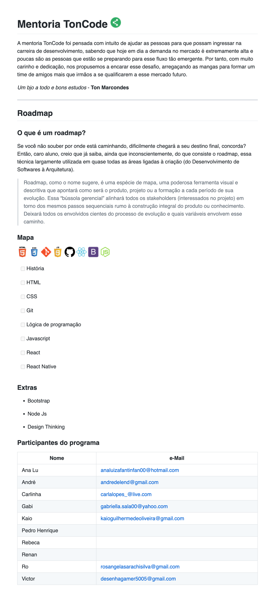

Mentoria TonCode
A mentoria TonCode foi pensada com intuito de ajudar as pessoas para que possam ingressar na carreira de desenvolvimento, sabendo que hoje em dia a demanda no mercado é extremamente alta e poucas são as pessoas que estão se preparando para esse fluxo tão emergente. Por tanto, com muito carinho e dedicação, nos propusemos a encarar esse desafio, arregaçando as mangas para formar um time de amigos mais que irmãos a se qualificarem a esse mercado futuro.
Um bjo a todo e bons estudos - Ton Marcondes

Roadmap
O que é um roadmap?
Se você não souber por onde está caminhando, dificilmente chegará a seu destino final, concorda? Então, caro aluno, creio que já saiba, ainda que inconscientemente, do que consiste o roadmap, essa técnica largamente utilizada em quase todas as áreas ligadas à criação (do Desenvolvimento de Softwares à Arquitetura).

Roadmap, como o nome sugere, é uma espécie de mapa, uma poderosa ferramenta visual e descritiva que apontará como será o produto, projeto ou a formação a cada período de sua evolução. Essa “bússola gerencial” alinhará todos os stakeholders (interessados no projeto) em torno dos mesmos passos sequenciais rumo à construção integral do produto ou conhecimento. Deixará todos os envolvidos cientes do processo de evolução e quais variáveis envolvem esse caminho.

Mapa
História
HTML
CSS
Git
Lógica de programação
Javascript
React
React Native

Extras
Bootstrap
Node Js
Design Thinking

Participantes do programa
Nome e-Mail
Ana Lu analuizafantinfan00@hotmail.com 
André andredelend@gmail.com 
Carlinha carlalopes_@live.com 
Gabi gabriella.sala00@yahoo.com 
Kaio kaioguilhermedeoliveira@gmail.com 
Pedro Henrique  
Rebeca  
Renan  
Ro rosangelasarachisilva@gmail.com 
Victor desenhagamer5005@gmail.com 

